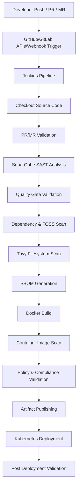

# Secure DevSecOps CI/CD Pipeline with Shift-Left Security

<div align="center">


# Enterprise Grade DevSecOps Pipeline

### Secure • Automated • Scalable • Reusable • Compliance-Ready


</div>

---

# Overview

This repository demonstrates a production-pattern **DevSecOps CI/CD Pipeline** engineered with strong focus on:

- Shift-Left Security
- Secure Software Supply Chain
- Automated PR/MR Validation
- Reusable Jenkins Shared Libraries
- Continuous Security & Compliance
- Enterprise CI/CD Standardization
- Audit & Governance Readiness

The pipeline integrates security scanning directly into the CI/CD lifecycle to identify vulnerabilities at the earliest possible stage before deployment.

---

# Key Security Implementations

## Shift-Left Security

Security is integrated from the beginning of the Software Development Lifecycle (SDLC).

### Security Controls Included

- Static Application Security Testing (SAST)
- SonarQube Quality Gate Validation
- Secret Scanning
- Filesystem Vulnerability Scanning
- Container Image Scanning
- Infrastructure-as-Code (IaC) Scanning
- FOSS Dependency Scanning
- License Compliance Validation
- SBOM Generation
- Supply Chain Security Validation

---

# CI/CD Pipeline Flow

## High-Level Pipeline Architecture



## Main Pipeline Stages
CI/CD Stages Implemented:

```
| Stage                 | Purpose                          |
| --------------------- | -------------------------------- |
| Source Checkout       | Pull source code from SCM        |
| PR/MR Detection       | Validate Pull/Merge Requests     |
| SonarQube Scan        | Perform SAST analysis            |
| Quality Gate          | Block insecure code merge        |
| Dependency Scan       | FOSS vulnerability validation    |
| Filesystem Scan       | Detect secrets & vulnerabilities |
| SBOM Generation       | Supply-chain transparency        |
| Docker Build          | Build container image            |
| Image Scan            | Container vulnerability scanning |
| Artifact Publishing   | Push artifacts/images            |
| Kubernetes Deployment | Deploy securely to cluster       |
| Compliance Validation | Audit & governance readiness     |
```
## Pull Request / Merge Request Automation
The pipeline automatically detects and validates:
```
Pull Requests to main
Merge Requests
Feature Branches
Fork-based Contributions
```
Integrated using:
```
GitHub APIs/GitLab APIs or Webhooks
Automated SCM Event Detection
```
This enables automated security validation before merge approval.

## SonarQube Integration
Integrated SonarQube Quality Gates for:
```
SAST Analysis
Vulnerability Detection
Security Hotspots
Code Smells
Maintainability Metrics
Coverage Validation
```

## Pipeline Enforcement
Builds are automatically blocked if:
```
Vulnerability threshold exceeds limits
Quality Gate fails
Coverage drops below threshold
Critical bugs are detected
```
## Trivy Security Scanning
Integrated Trivy Scanning across multiple layers.
```
Filesystem Scan
Detects:

Vulnerabilities
Secrets
Misconfigurations
License Risks

Container Image Scan
Detects:

Base Image Vulnerabilities
Dependency Vulnerabilities
OS Package Risks

IaC Security Scan
Scans:

Kubernetes Manifests
Dockerfiles
YAML Configurations
```
## Software Supply Chain Security
SBOM Generation
```
Software Bill of Materials (SBOM) generation implemented using:
SPDX/CycloneDX
```
Benefits
```
Dependency Transparency
Audit Compliance
Supply Chain Integrity
Vulnerability Traceability
```
## FOSS Dependency Scanning
Integrated open-source dependency validation for:
```
Vulnerable Libraries
Outdated Packages
License Violations
Supply Chain Threats
```
## Jenkins Shared Library Architecture
One of the major highlights of this project is the implementation of reusable Jenkins Shared Libraries.
## Why Shared Libraries?
Instead of writing repetitive Jenkins logic across multiple pipelines, reusable modules were created for:
```
PR Validation
Feature Branch Validation
Fork Repository Validation
SonarQube Scanning
Trivy Scanning
Report Generation
```

## Repository Structure
```
├── devsecops-project
│   ├── pom.xml
│   ├── src
│   │   ├── main
│   │   │   ├── java
│   │   │   │   └── com
│   │   │   │       └── example
│   │   │   │           └── devsecops
│   │   │   │               ├── controller
│   │   │   │               │   └── HealthController.java
│   │   │   │               ├── DevsecopsApplication.java
│   │   │   │               └── service
│   │   │   │                   └── HealthService.java
│   │   │   └── resources
│   │   │       └── application.yml
│   │   └── test
│   │       └── java
│   │           └── com
│   │               └── example
│   │                   └── devsecops
│   │                       ├── controller
│   │                       │   └── HealthControllerTest.java
│   │                       └── service
│   │                           └── HealthServiceTest.java
│   └── target
│       ├── classes
│       │   ├── application.yml
│       │   └── com
│       │       └── example
│       │           └── devsecops
│       │               ├── controller
│       │               │   └── HealthController.class
│       │               ├── DevsecopsApplication.class
│       │               └── service
│       │                   └── HealthService.class
│       ├── enterprise-devsecops-demo-1.0.0.jar
│       ├── enterprise-devsecops-demo-1.0.0.jar.original
│       ├── generated-sources
│       │   └── annotations
│       ├── generated-test-sources
│       │   └── test-annotations
│       ├── maven-archiver
│       │   └── pom.properties
│       ├── maven-status
│       │   └── maven-compiler-plugin
│       │       ├── compile
│       │       │   └── default-compile
│       │       │       ├── createdFiles.lst
│       │       │       └── inputFiles.lst
│       │       └── testCompile
│       │           └── default-testCompile
│       │               ├── createdFiles.lst
│       │               └── inputFiles.lst
│       ├── surefire-reports
│       │   ├── com.example.devsecops.controller.HealthControllerTest.txt
│       │   ├── com.example.devsecops.service.HealthServiceTest.txt
│       │   ├── TEST-com.example.devsecops.controller.HealthControllerTest.xml
│       │   └── TEST-com.example.devsecops.service.HealthServiceTest.xml
│       └── test-classes
│           └── com
│               └── example
│                   └── devsecops
│                       ├── controller
│                       │   └── HealthControllerTest.class
│                       └── service
│                           └── HealthServiceTest.class
├── Dockerfile
│   └── Dockerfile
├── K8s
│   └── app.yaml
├── LICENSE
├── Pipeline
│   ├── feature-to-main-pipeline.groovy
│   ├── fork-to-feature-pipeline.groovy
│   └── vars
│       ├── buildAndTest.groovy
│       ├── errorLogging.groovy
│       ├── gitCheckOut.groovy
│       ├── mailNotification.groovy
│       ├── sastAnalysis.groovy
│       ├── sbomGeneration.groovy
│       └── trivyScan.groovy
├── README.md
```

## Tech Stack
```
| Category              | Tools                    |
| --------------------- | ------------------------ |
| CI/CD                 | Jenkins                  |
| SCM                   | GitHub / GitLab          |
| Security              | Trivy                    |
| SAST                  | SonarQube                |
| Containerization      | Docker                   |
| Orchestration         | Kubernetes               |
| Supply Chain Security | Trivy                    |
| Automation            | Jenkins Shared Libraries |
| Artifact Management   | Docker Registry / Nexus  |
```

Repository Reference: :contentReference[oaicite:1]{index=1}
::contentReference[oaicite:2]{index=2}
